# Bem Vindos ao Tutorial AWS para membros do LDGH

Aqui você encontrá varios passo-a-passo de cpmo começar a usar serviços da AWS e aplicações desenvolvidas pelo LDGH.

Se você é membro do LDGH e ainda não tem usuario e senha para AWS, entre em contato com o membro do LDGH responsavel pela administração da AWS.

Com o seu Usuario e Senha em mãos siga para o proximos passos.

## Login no Console AWS

Abra a pagina de [LOGIN](https://signin.aws.amazon.com/signin?redirect_uri=https%3A%2F%2Fconsole.aws.amazon.com%2Fconsole%2Fhome%3Ffromtb%3Dtrue%26hashArgs%3D%2523%26isauthcode%3Dtrue%26nc2%3Dh_ct%26src%3Dheader-signin%26state%3DhashArgsFromTB_us-east-1_0062f4bf4d209a7f&client_id=arn%3Aaws%3Asignin%3A%3A%3Aconsole%2Fcanvas&forceMobileApp=0&code_challenge=xfuZKCElpIHAsP7o58lVIeaAlR_rhhPH-CuBIUCzL98&code_challenge_method=SHA-256) na AWS. 

 - Escolha a opção "IAM User".
 - Informe o ID da conta do LDGH (452996723585).
 - Clique no botão [Next].
 

  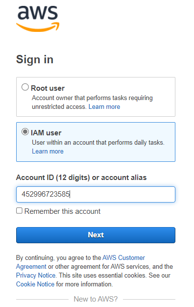
 

 
 - Insira seu usuario e senha
 - Clique no botão [Sign in]
 

 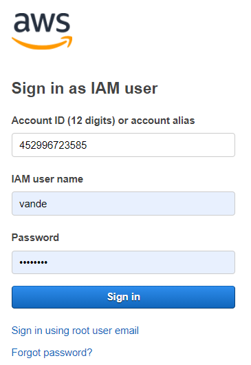
 

 
 - Pronto, agora você esta logado na AWS.
 - Por questão de segurança os você terá acesso limitado apenas alguns recursos da AWS.
 - Aqui você poderá:
   - Cria Instancias EC2; ***são maquinas virtuais, onde você poderá configurar como quiser.***
   - Usar as Instancias existentes; ***são maquinas virtuais, que alguem configurou para um proposito específico.***
   - Acessas os Bancos de Dados;
   - Usar os demais serviços da AWS;
  
  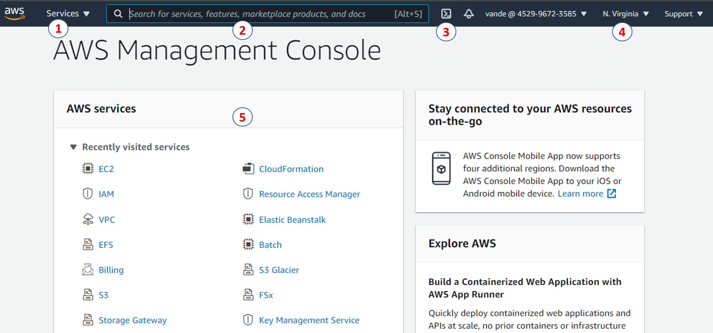
 
  - Coisa importantes para saber sobre essa pagina principal
   1. Lista dos Serviços da AWS;
   2. Barra de busca de serviços da AWS;
   3. Terminal Shell, ***terminal para executar comandos shell, utilizado para executar tarefas simples*** 
   4. Selecionar a região na qual você está conectado; ***É muito importante saber em qual região você esta conectado***
   5. Serviços da AWS recentemente acessados;
       
# Crair instancia EC2

  Uma instância nada mais é que uma maquiva virtual, configurada de acordo com suas necessidades.
  Ao Criar uma instância EC2, você poderá escolher o Sistema Operaciona, quantidade de processadores, Memoria RAM, HD e outras configurações.
  
  - Vamos ao Passo-a-Passo

  1. Na barra de busca, digite EC2,  escolha a opção  **"EC2 Virtual Servers in the cloud"**
  
  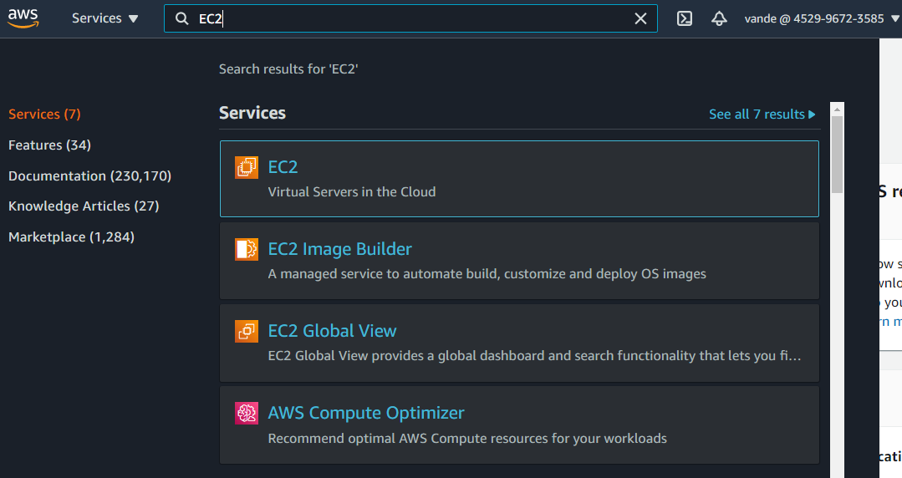
 
  2. Nesta area, estão todos os serviços da AWS relacioados a EC2.
     Por enquanto, vamos focar apenas em 2 pontos. 
     - As instâncias que foram criadas. **Instances**
     - As instâncias que estão em execução **Instances (running)**
     
  Clique em **Instances** e vamos começar a criar sua primeira Instância
  
  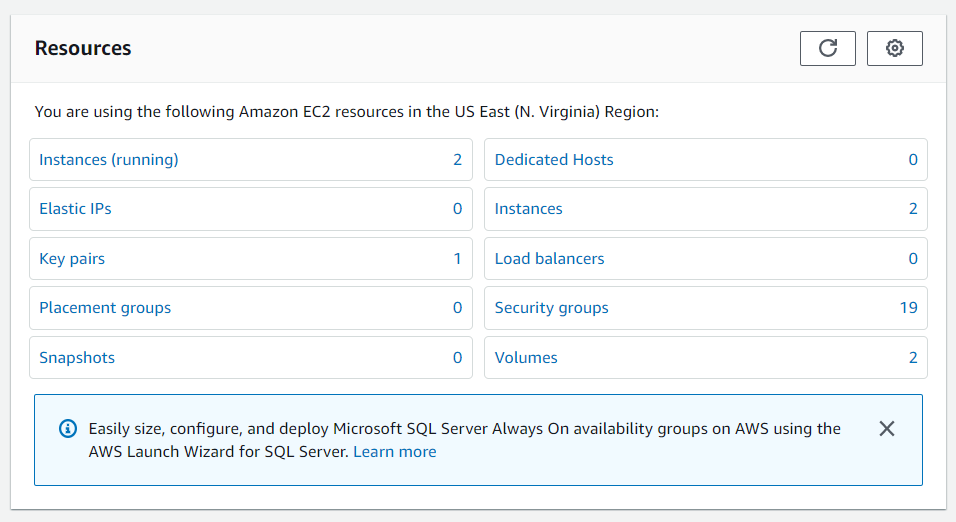
 
 3. Clique no botão **"Launch instances"**
 
  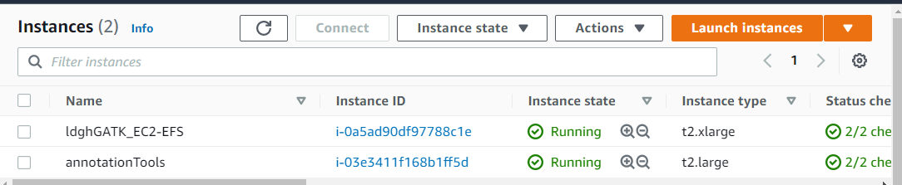
 
 4. Escolha a imagem de uma maquina (AMI). 
    Existem vários tipos de servidores com direfentes Sistemas Operacionais: Windows, Linux, MacOS.
    Escolha a imagem: **"Amazon Linux 2 AMI (HVM)"**
    
  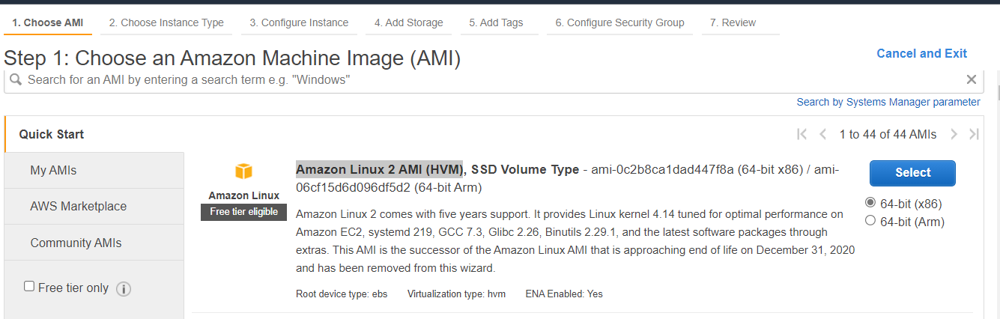
 
 5. Escolha o tipo da imagem, com diferentes caracteristicas, sobre número de processadores, memoria RAM, transferência de dados, tipo de HD entre outros.
    Para mais informações [Clique Aqui](https://aws.amazon.com/pt/ec2/instance-types/)
    - Escolha o tipo **"t2.micro"**
 6. Clique em **"Review and Launch"**, isto vai pular algumas epatas de configuração de redes, storage, grupos. E levará para ultima etapa de revisão e Finalização.
 
  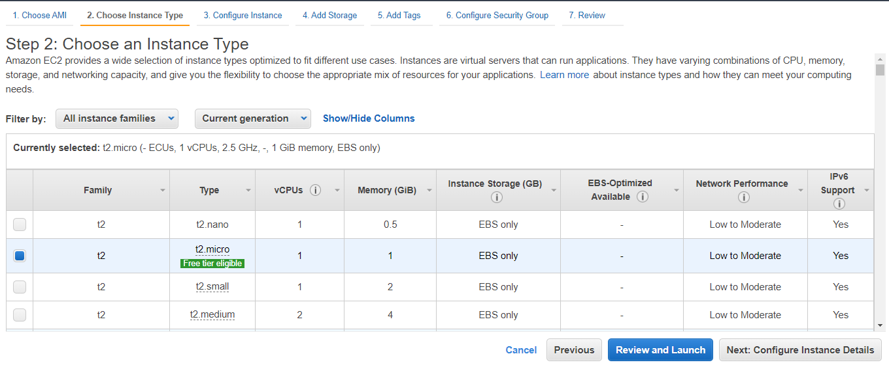
 
 7. Clique em **"Launch".**
 Após isso, será necessario escolher/criar um arquivo chave de autentificação para conectar com a instância via SSH.
 Atualmente, já existe um arquivo criado que pode ser utilizado **"ldghkeyPair"**
 Clique em **"Launch Instances"**. Pronto, agora sua instancia já esta criada e pronta para ser utilizada. 
 **Nos proximos passas iremos aprender a conectar nessa ou em outras instancias criadas.**
  
  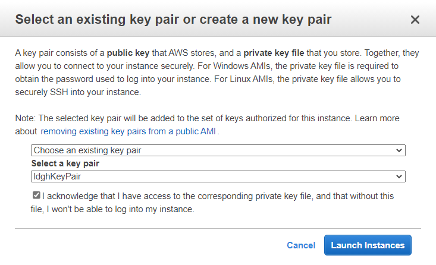
 
 ## Conectar em uma intância EC2
   Aqui iremos aprender a conectar em uma instancia EC2 via Console e via SSH.
   Utilizaremos como teste a intancia que acabamos de criar na etapa anterior.
   
   Estando conectado em sua conta na pagina da AWS. Iremos acessar os serviços de **EC2** e vizualizar as instancias existentes.
   Na imagem abaixo, podemos vizualizar 5 instancias, com **status** diferentes **(Running, Stopped, Terminated)**
   - Running: indica que a instância esta ligada, pronta para ser usada;
   - Stopped: indica que a instância esta desligada, é preciso ligar para ser usada;
   - Terminated: indica que a instância foi deletada, não podendo ser conectada;

   Todos os usuarios do LDGH tem permissão de Criar, Ligar, Desligar e Deletar instancias.
   Toda instancia tem um ID unico, iremos conectar na instancia, i-0214ff11ceaf2e870, recem criada.
   Selecione a instância e depois clique no botão **Connect**
     
  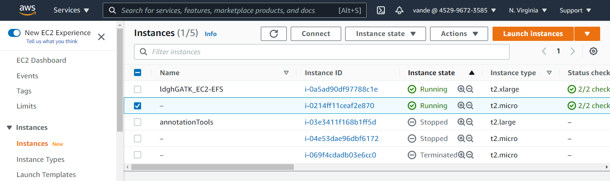
 
 
 Agora teremos duas formas de conecta em uma intancia EC2, via Console e via SSH
 
 1. Via Conosole. 
 Conectando atraves do navegador web. 
 Para conectar, basta clicar no botão **Connect** e uma nova aba em seu navegador vai abrir.  
       
 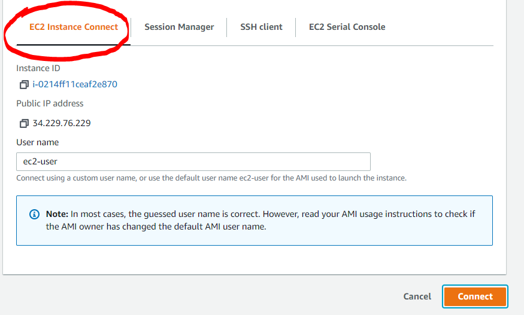
 
 Pronto, você já está logado na instancia.
 **OBS.: A conexão cai rapidamente se você não estiver interagindo, mas basta atualizar a pagina que a conexão é reestabelecida.**
        
 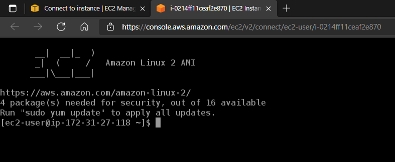
 
 2. Via SSH 
 Para conectar via ssh, será preciso ter salvo em seu computador o arquivo com a chave de conexão (ldghKeyPair.pem).
 Para obeter esse arquivo, você pode entrar em contato com o administrado da AWS do LDGH, ou baixar diretamente pelo AWS caso tenha permissão.
 
 Com o arquivo **ldghKeyPair.pem** salvo em seu computador, vamos para o passo a passo.
 
 **(ESTE TUTORIAL É PARA USARIOS QUE USAM O LINUX. PARA OS USUARIOS QUE USAM WINDOWNS, PODEM UTILIZAR O PUTTY E SEGUIR O TOTORIAL DO VIDEO ABAIXO)***  https://www.youtube.com/watch?v=bi7ow5NGC-U
  
  1. Abra o terminal shell no diretorio onde o arquivo ldghKeyPair.pem foi salvo. 
  2. Execute o comando: **chmod 400 ldghKeyPair.pem**, caso tenha problema de permissão.
  3. Execute o camando: **ssh -i "ldghKeyPair.pem" ec2-user@ec2-34-229-76-229.compute-1.amazonaws.com**
  **OBS.:** O IP da instancia **ec2-34-229-76-229.compute-1.amazonaws.com**, irá mudar toda vez que a instancia foi desligada e ligada novamente.
  
 
 ### FIM
  
 
 
 
 # Tutorial sobre Storages
 
 
 
 
     
     

