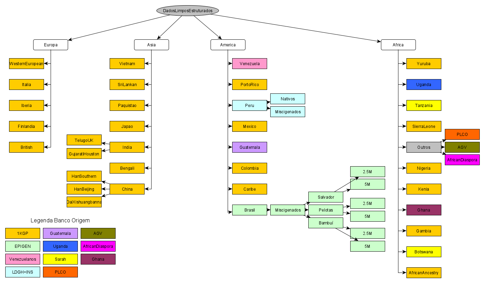

# Banco de Dados LDGH
A AWS fornece diversos servicos para banco de dados.

Atualmente, estamos utilizando dois tipos de serviços (S3 e EFS).
Mais informaçõeos podem ser obtidas nos tutorial sobre Storages().

## S3 (s3-ldgh)
  Aqui, estão armazenados os bancos de dados:
  - DadosLimposEstruturados;
  
### Descrição

**DadosLimposEstruturados** -  Bancos de dados genéticos para diferentes populações. Estruturado pela Marla.

 

 
 

 
## EFS (efs-ldhg/database)
Aqui, estão armazenados os bancos de dados:
  - PharmGKB
    - ClinicalGuidanceAnnotations/
    - DrugLabelAnnotations/  
    - VariantAndClinicalAnnotaionsData/
    - ClinicalVariantData/          
    - Pathways/
    - VariantGeneDrugRelationshipData/
  - gatk_vcf
  - humanGenome

### Descrição

**PharmGKB** O banco do PharmGKB esta organizado em pastas de acordo com a pagina web. https://www.pharmgkb.org/downloads
Procurar pelos arquivos .tsv
  - ClinicalGuidanceAnnotations/ 
  - DrugLabelAnnotations/  
  - VariantAndClinicalAnnotaionsData/  <-  Aqui estão os arquivos principais ( clinical_annotations.tsv)
  - ClinicalVariantData/          
  - Pathways/
  - VariantGeneDrugRelationshipData/
A descrição sobre o que tem em cada pasta, pode ser encontrada na site do pharmgkb https://www.pharmgkb.org/downloads

